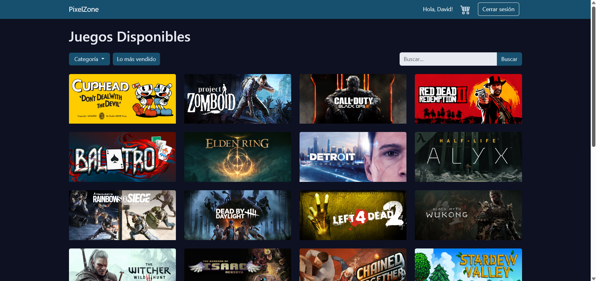
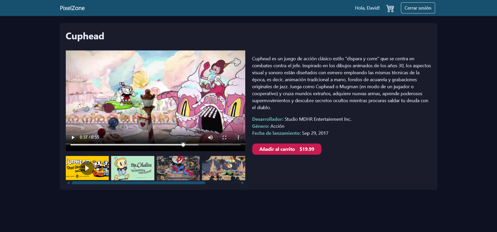
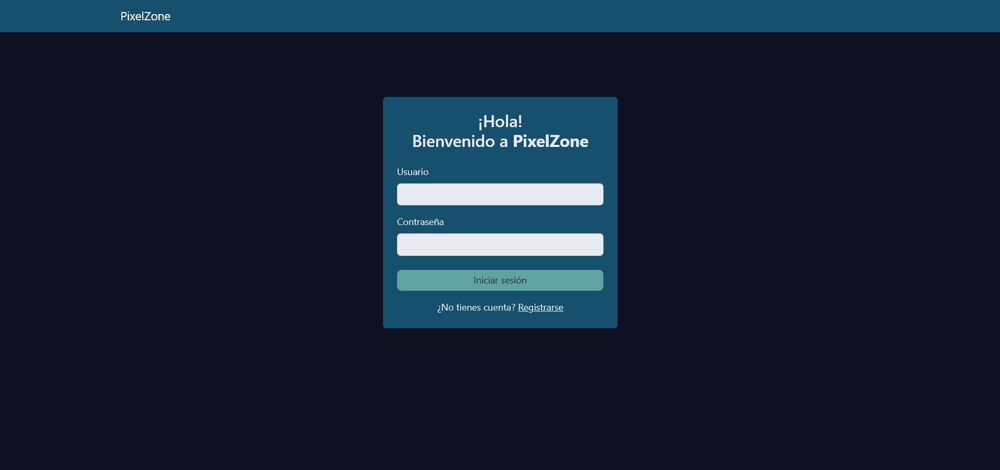

# PixelZone

[](https://pixelzone.onrender.com)

PixelZone es una tienda virtual de videojuegos, desarrollada con Django. Permite a los usuarios explorar, buscar y comprar juegos, así como a los administradores gestionar el catálogo y las compras. Incluye integración con la API de Steam para mostrar los juegos más populares, búsqueda avanzada y un sistema de carrito de compras.

## 🌐 Demo en línea

Puedes acceder a la aplicación desplegada en:  
👉 [https://pixelzone.onrender.com](https://pixelzone.onrender.com)

---

## Vista previa

### Página principal – Lista de juegos



### Vista de detalle de un juego



### Página de inicio de sesión



## Características principales

- **Catálogo de juegos**: Visualiza juegos con imágenes, descripciones, videos y filtros por género.
- **Juegos populares de Steam**: Muestra los 30 juegos más jugados actualmente en Steam, con precios, descuentos y detalles.
- **Búsqueda avanzada**: Busca juegos por nombre o género, incluyendo integración con la API de Steam.
- **Carrito de compras**: Añade juegos al carrito y realiza compras.
- **Gestión de usuarios**: Registro, inicio de sesión y roles de usuario (usuario normal y administrador).
- **Administración**: Los administradores pueden agregar, editar y eliminar juegos, así como ver y gestionar compras.
- **Facturación**: Visualización de facturas de compra para usuarios y administradores.

## Instalación

1. **Clona el repositorio**

   ```sh
   git clone https://github.com/Adavidfr/pixelzone.git
   cd pixelzone
   ```

2. **Crea un entorno virtual (opcional pero recomendado)**

   ```sh
   python -m venv venv
   source venv/bin/activate  # En Windows: venv\Scripts\activate
   ```

3. **Instala las dependencias necesarias**

   ```sh
   pip install django
   pip install python-steam-api
   pip install django-widget-tweaks
   ```

4. **Configura tu clave de API de Steam**

   - Crea un archivo `.env` en la raíz del proyecto y agrega tu clave de API de Steam:
     ```
     STEAM_API_KEY=tu_clave_de_api
     ```

5. **Realiza las migraciones**

   ```sh
   python manage.py migrate
   ```

6. **Crea un superusuario para acceder al panel de administración**

   ```sh
   python manage.py createsuperuser
   ```

7. **Inicia el servidor de desarrollo**

   ```sh
   python manage.py runserver
   ```

8. **Accede a la aplicación**
   - Sitio principal: [http://localhost:8000/](http://localhost:8000/)
   - Panel de administración: [http://localhost:8000/admin/](http://localhost:8000/admin/)

---

## Rutas principales

### `/` (Página principal)

Muestra la lista de juegos disponibles en PixelZone, con opciones de búsqueda y filtros.

### `/api/`

Muestra la pantalla principal consumiendo la api que nos da información de los juegos más jugados

### `api/buscar_juegos/`

Permite realizar una búsqueda avanzada de juegos en la API de Steam.

### `/api/juego/<appid>/`

Muestra los detalles de un juego específico obtenido desde la API de Steam, incluyendo descripción, precios, descuentos, imágenes y videos.

### `/admin/`

Panel de administración para gestionar juegos, usuarios y compras.

---

## Estructura del proyecto

- `juegos/`: Gestión del catálogo de juegos.
- `tienda/`: Carrito de compras, compras y facturación.
- `steamapp/`: Integración con la API de Steam, incluyendo juegos populares.
- `usuarios/`: Registro e inicio de sesión de usuarios.
- `templates/`: Plantillas HTML base y compartidas.

## Dependencias principales

- Django
- python-steam-api
- django-widget-tweaks
- python-decouple (para manejar variables de entorno)

## Funcionalidades destacadas

- Registro e inicio de sesión de usuarios.
- Visualización y filtrado de juegos.
- Carrito de compras y proceso de compra.
- Administración de juegos y compras.
- Búsqueda de juegos en Steam.
- Visualización de los juegos más populares en Steam con precios y descuentos.

## Notas

- Asegúrate de tener Python 3.8+ instalado.
- Configura tu clave de API de Steam en el archivo `.env` para que las funcionalidades relacionadas con Steam funcionen correctamente.
- Puedes personalizar la lógica de integración con Steam en [`steamapp/steam_service.py`](steamapp/steam_service.py).

---

¡Gracias por usar PixelZone!
